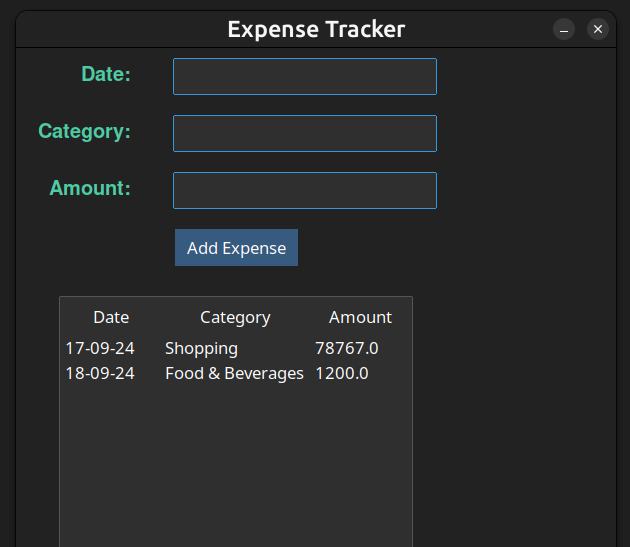

# QuickManage

Desktop app for managing expenses



## Features

- **Dark Mode Interface**
- **Add Expenses**
- **Edit Expenses**
- **Delete Expenses**
- **Total Expenses Calculation**

## Tech stack

- Python 3.11.6
- `tkinter` lib
- `ttkbootstrap` lib
- SQLite (from standard lib)

## Setup and Installation

1. **Clone the Repository**

   ```bash
   git clone git@github.com:J11tendra/QuickManage.git
   cd expense-tracker
   ```

2. **Create an environment**

   ```bash
   python -m venv venv
   source venv/bin/activate
   ```

3. I**nstall dependencies**

   ```bash
   pip install tkinter
   pip install ttkbootstrap
   ```

4. **Run the file**

   ```bash
   python3 main.py
   ```
